# 🛒 Shop Now

A modern and responsive e-commerce web application built with **React** and **Vite**. Shop Now provides a smooth shopping experience with product browsing, advanced filtering, category-based navigation, cart management, secure authentication using Clerk, and a clean, user-friendly interface.

> **Live Demo:** Coming Soon
> **Repository:** Coming Soon

---

## 📌 Project Overview

Shop Now is a frontend e-commerce application that allows users to browse products, search and filter items, view detailed product information, and manage their shopping cart efficiently.

The application uses the **DummyJSON Products API** to fetch real product data and stores cart information in **Local Storage**, allowing users to keep their cart even after refreshing the browser.

For authentication, **Clerk Authentication** is integrated. Users can add items to the cart without logging in, but they must create an account and sign in before accessing the Cart page.

---

## ✨ Features

### 🛍️ Product Management

- Browse all available products
- Product Listing
- Product Details Page
- Product Description
- Category Specific Product Pages
- Pagination

### 🔍 Search & Filtering

- Search Products
- Filter by Category
- Filter by Brand
- Filter by Price Range

### 🛒 Shopping Cart

- Add to Cart
- Remove from Cart
- Update Product Quantity
- Cart Data Stored in Local Storage
- Bill Details Calculation
- Product Total
- Handling Charges
- Delivery Charges
- Discount Calculation using Promo Code abdul00

### 🔐 Authentication

- Clerk Authentication
- Protected Cart Page
- Users can add products without logging in
- Cart page is accessible only after authentication
- Login/Register popup displayed when unauthorized users attempt to access the cart

### 🎨 User Experience

- Responsive Design
- Loading Animations
- Toast Notifications
- Image Slider
- Slider Navigation Buttons
- Detect Current Location

---

## 📄 Pages

- 🏠 Home
- 🛍️ Products
- 📂 Category Specific Products
- 📦 Single Product Details
- 🛒 Cart
- ℹ️ About
- 📞 Contact Us

---

## 🛠️ Tech Stack

### Frontend

- React
- Vite
- JavaScript
- Tailwind CSS

### Routing

- React Router DOM

### State Management

- Context API
- useReducer

### Authentication

- Clerk Authentication

### API

- Fetch API
- DummyJSON Products API

### Libraries

- React Toastify
- React Slick
- Lottie

---

## 🌐 API Used

**DummyJSON Products API**

https://dummyjson.com/products

---

## 📸 Screenshots

### 🏠 Home Page


---

### 🛍️ Products Page

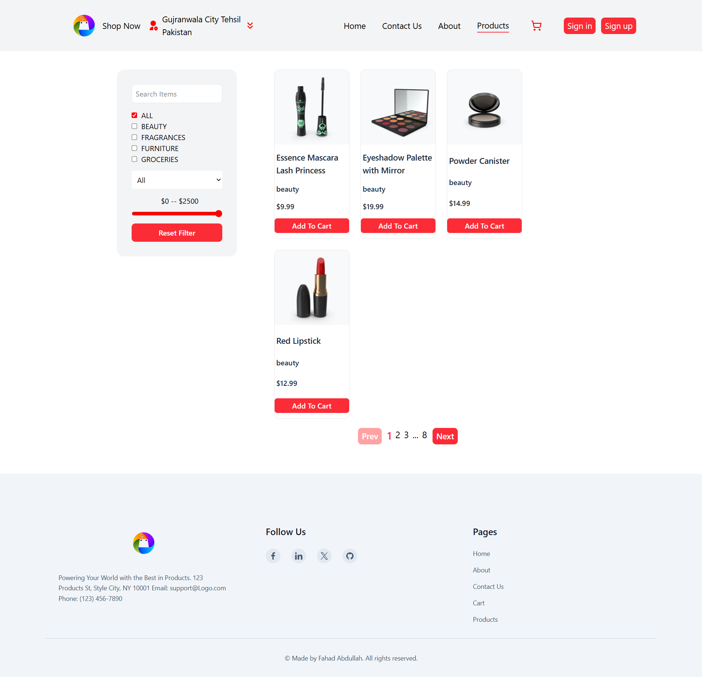

---

### 🔍 Search & Filter

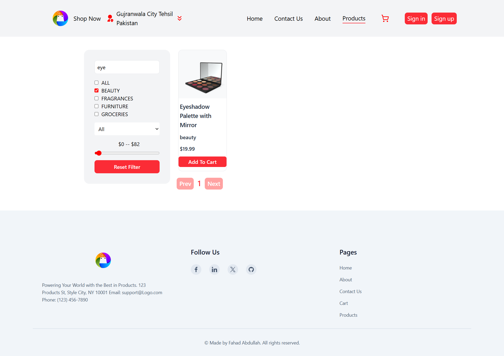

---

### 📂 Category Specific Products

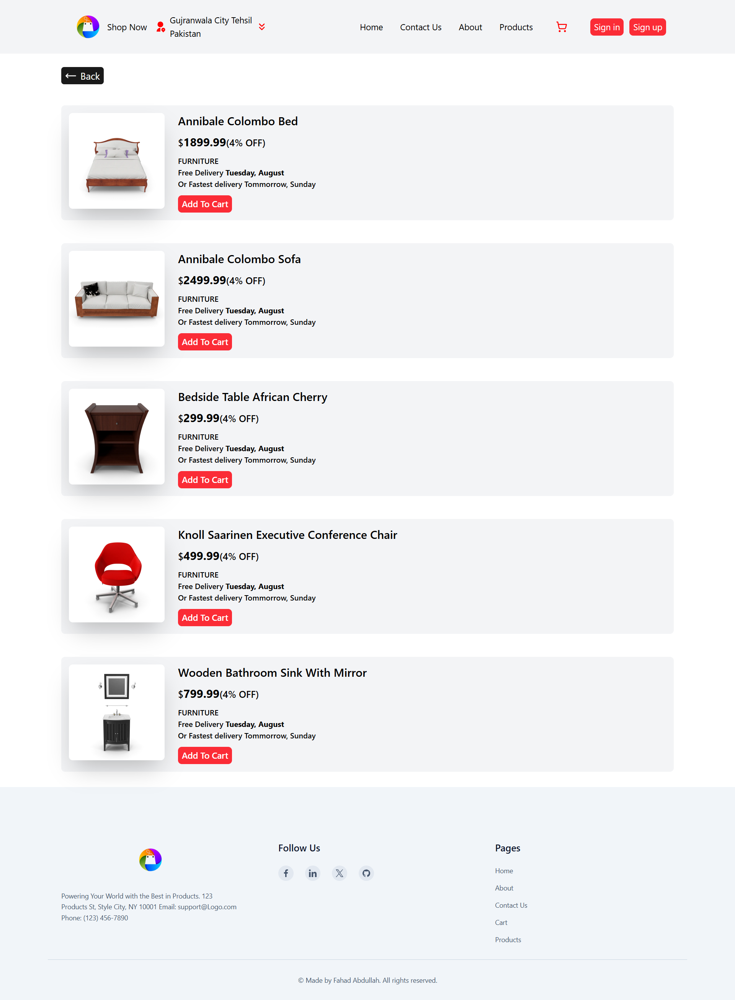

---

### 📦 Single Product Details

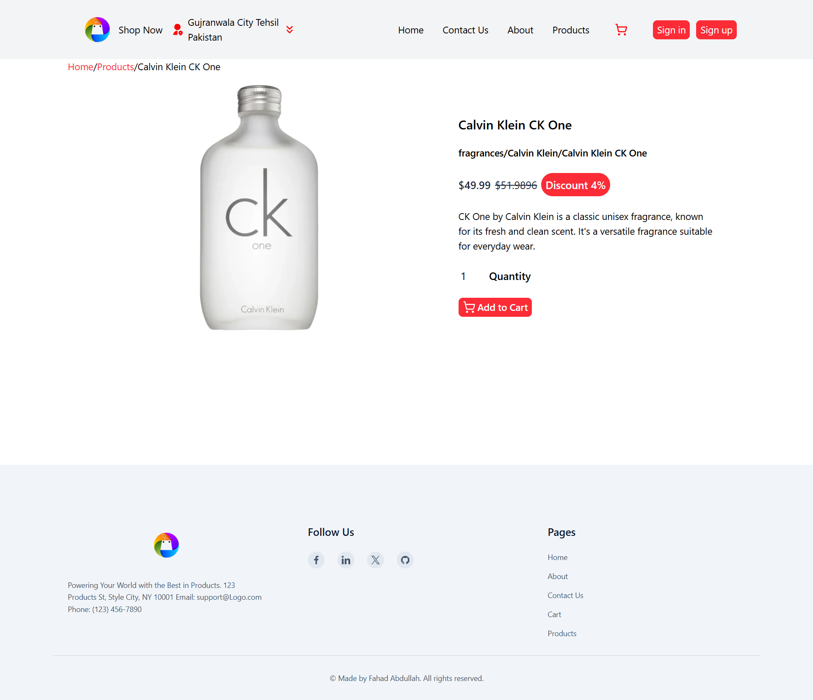

---

### 🛒 Shopping Cart

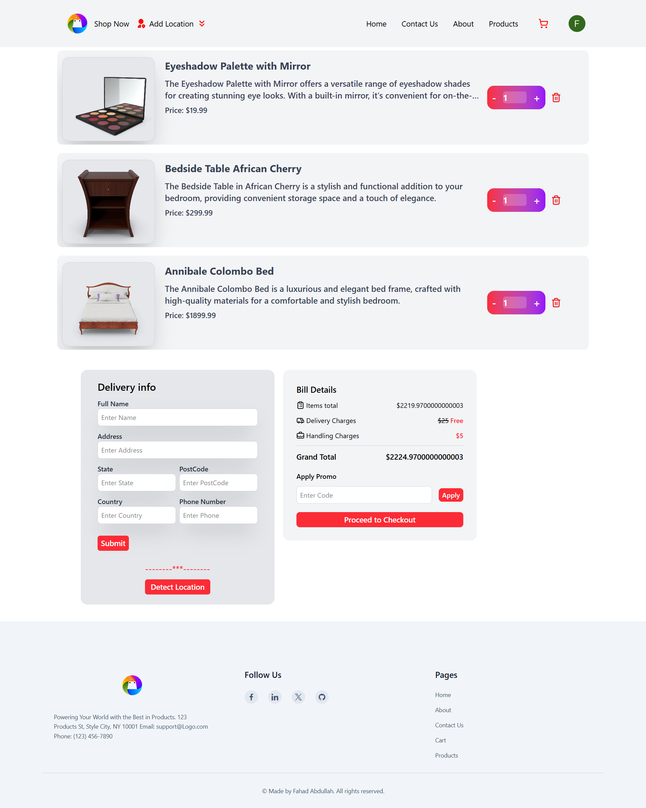

---

### 💰 Bill Details & Promo Discount Before Apply Promo

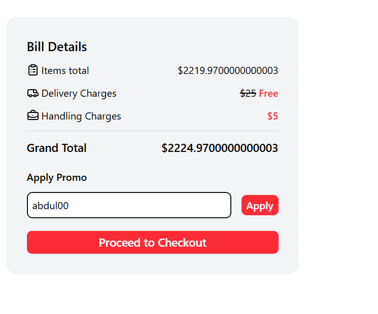

---

### 💰 Bill Details & Promo Discount After Apply Promo

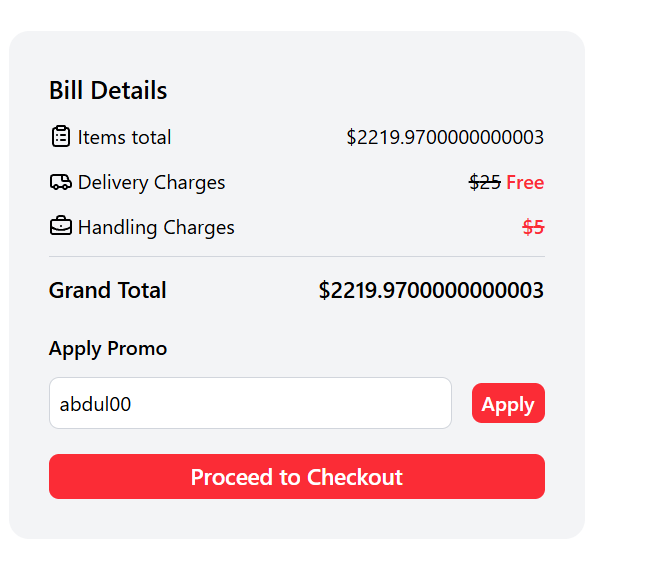

---

### 🔐 Authentication

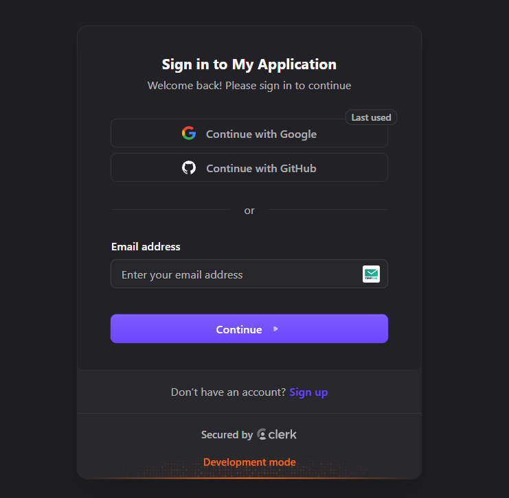

---

### 📱 Responsive Home Pge Design

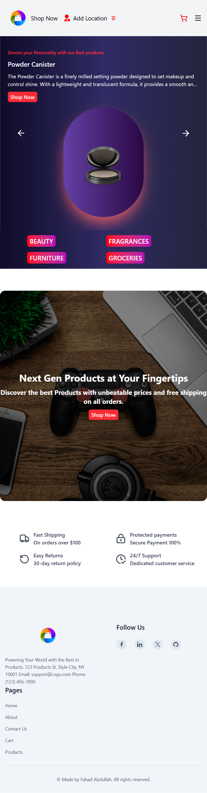

---

### 📱 Responsive Products Pge Design

## 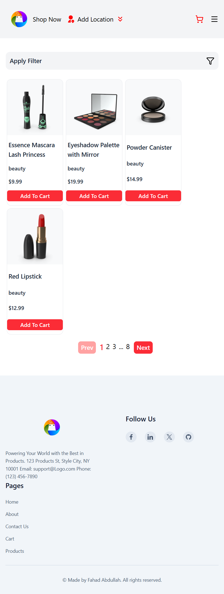

---

### 📱 Responsive Cart Pge Design

## 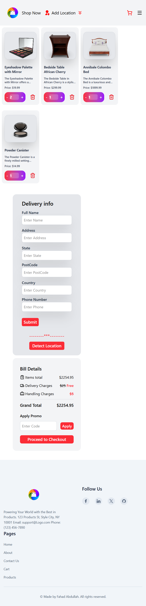

---

### 🎞️ Product Slider

## 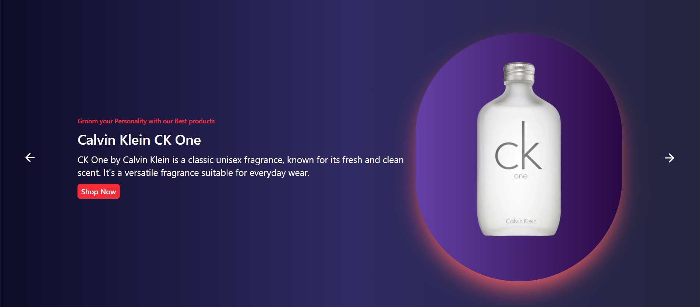

---

### 🔔 Toast Notifications

## 

---

## 🚀 Installation

Clone the repository

```bash
git clone <repository-url>
```

Move into the project folder

```bash
cd shop-now
```

Install dependencies

```bash
npm install
```

Start the development server

```bash
npm run dev
```

Create a production build

```bash
npm run build
```

Preview the production build

```bash
npm run preview
```

---

## 🔑 Environment Variables

Create a `.env` file in the root directory and add your Clerk credentials.

```env
VITE_CLERK_PUBLISHABLE_KEY=your_publishable_key
```

---

## 📂 Project Highlights

- Clean component-based architecture
- Responsive UI for different screen sizes
- Efficient state management using Context API and useReducer
- Local Storage integration for persistent cart data
- Protected routes using Clerk Authentication
- Dynamic product filtering and searching
- API integration with Fetch API
- Smooth user experience with animations and notifications

---

## 📚 What I Learned

While building this project, I improved my understanding of:

- React component architecture
- Context API with useReducer
- Client-side routing using React Router
- Fetching and displaying API data
- Local Storage implementation
- Protected routes and authentication
- Building reusable UI components
- Responsive design using Tailwind CSS
- Managing complex application state
- Creating a better user experience with animations and notifications

---

## 🔮 Future Improvements

- Wishlist functionality
- Product sorting options
- Order history
- User profile page
- Multiple payment options
- Product reviews and ratings
- Recently viewed products
- Better performance optimization
- Skeleton loading screens

---

## 👨‍💻 Author

**Fahad Abdullah**

Frontend Developer

LinkedIn: Coming Soon

GitHub: Coming Soon
